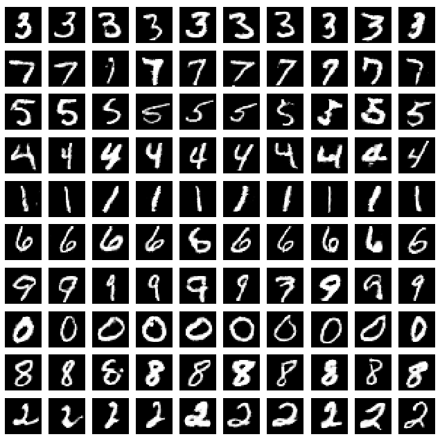

## Using GANs for unsupervised digit learning

Implementation of unsupervised digit classification on MNIST, as described in https://arxiv.org/abs/1606.03657, "
InfoGAN: Interpretable Representation Learning by Information Maximizing Generative Adversarial Nets".

Once unsupervised labels are learned, we perform classification by mapping each unsupervised label (10 by default) to the true digit label it most frequently matches.

This implementation differs from the above paper by only incorporating discrete labels into the latent code.  No continuous variables (corresponding to stroke width and/or digit angle) are used.

Visualizations show 10 samples from each unsupervised label, separated by row.

## Using GANs for semi-supervised digit learning

Implementation of semi-supervised digit classification on MNIST, as described in https://arxiv.org/abs/1606.03498, "Improved Techniques for Training GANs". Uses a similar model and hyperparameters as https://github.com/openai/improved-gan.

Visualizations during training show a random sample of recently generated images.

## Usage

To learn unsupervised digit labels:

    $ python train_info_gan.py

To change the number of unsupervised labels to N (default 10):

    $ python train_info_gan.py --labels N

To learn semi-supervised digit labels:

    $ python train_semi_supervised.py

To change the number of training labels per class to N (default 10):

    $ python train_semi_supervised.py --class-labels N
    
## Unsupervised results

With 10 unsupervised labels, this GAN game sometimes chooses an alternate partition of the digits 4 and 9.  For instance, it might choose to group slanted 4's and 9's under one label, while grouping vertical 4's and 9's under a second label.  In doing so, the network is able to recover the unsupervised label with high accuracy, but these labels don't happen to correspond perfectly to human labels.

As the paper suggests, using continuous variables in the latent space to explain more variance (stroke width and digit angle) is likely to force the 10 discrete labels to better match human labels.

Using 20 unsupervised labels also reduces variance within label groups, forcing these labels to more closely match human labels (with obvious duplication).

Test error rate after 300 epochs:

10 unsupervised labels: 4-12% (usually depending on the partition of 4's and 9's)

20 unsupervised labels: ~2.4%

## Semi-supervised results

Semi-supervised learning, 10 labels per class: ~1.5%

## Visualizations

Digits generated with InfoGAN using 10 unsupervised labels:

